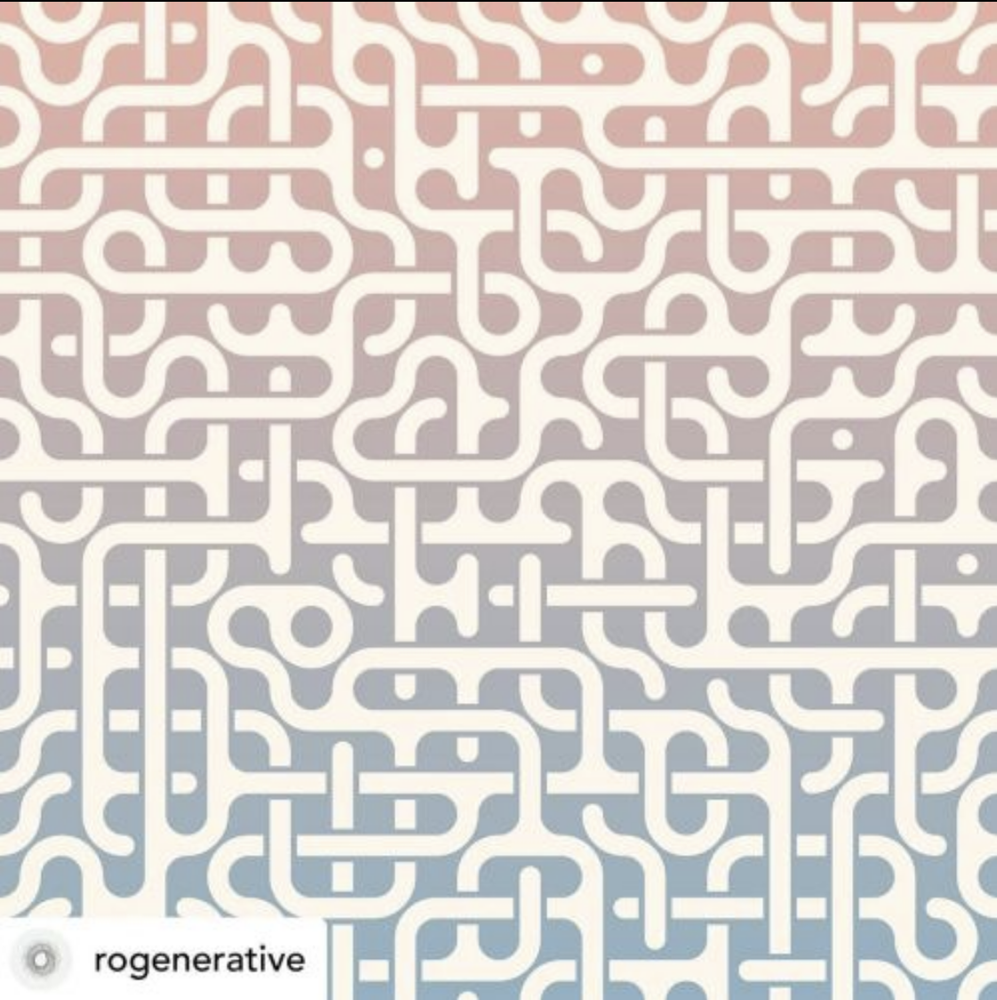
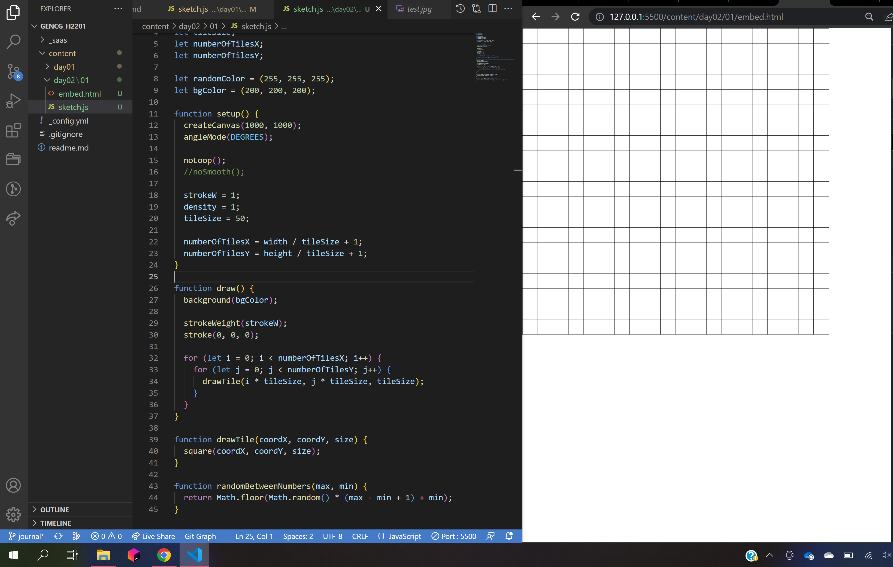
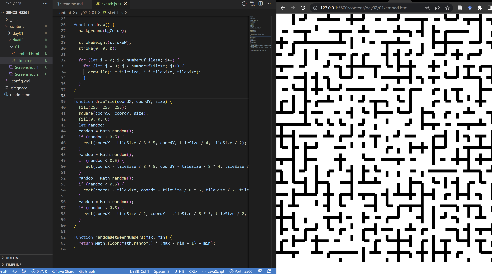
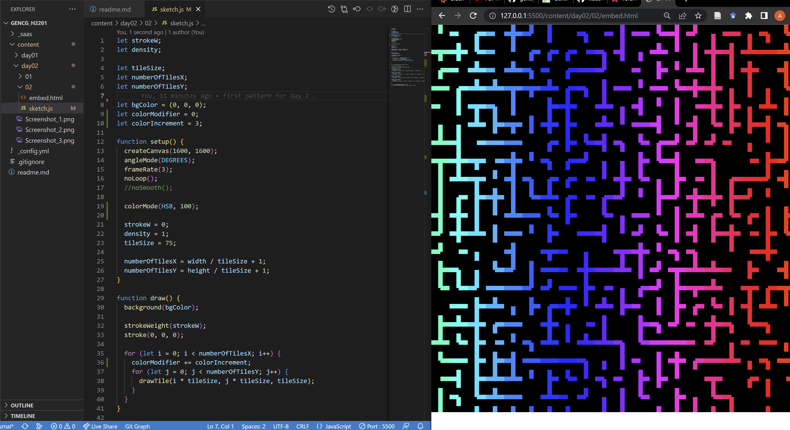
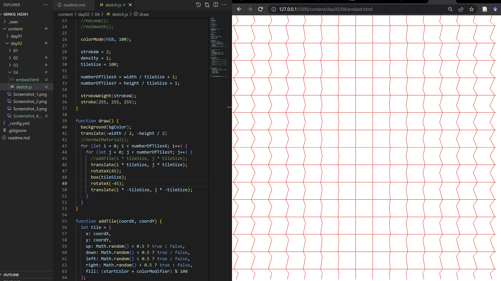

# Day 02

## Patterns

### First Pattern
For the first pattern I started to look for inspiration in some of the available examples.
Eventually, I came across this maze pattern that consists of multiple connecting tubes:

My approach for this was to first make a grid consisting of squares:

I could then add smaller shapes into the squares:

Every square can have up to 4 different lines inside of it, which is randomly determined. The four lines point in different directions and can connect with neighbouring tiles, creating small paths.

I then added some color in the form of a gradient over the columns.

### Interactability/Animation
Finally, I wanted to add an interactable element so the user could click different tiles and rotate them, to create their own pathways. This wasn't very exciting by itself, so I also added a small animation which constantly rotates randomly selected tiles.


<iframe src="content/day02/03/embed.html" width="100%" height="450px" frameborder="no"></iframe>


### Working in 3D
For the second pattern, I wanted to do something with in 3D with WebGL. I also started with creating a grid which can be resized through a given tile size variable. This time, I filled it with cubes. Making them rotate on one axis already resulted in a somewhat interesting animation.

Adding the p5js "normal material" to the cubes created this colorful result:


<iframe src="content/day02/06/embed.html" width="100%" height="450px" frameborder="no"></iframe>


Here with alternating direction of the rotation and an orthographic camera view:


<iframe src="content/day02/05/embed.html" width="100%" height="450px" frameborder="no"></iframe>


Afterwards, I started to play with the light source and how the cubes are illuminated by it. My experimentation ended in this moving pattern. The user can even interact with it, because the mouse also moves the light source around.


<iframe src="content/day02/04/embed.html" width="100%" height="450px" frameborder="no"></iframe>
