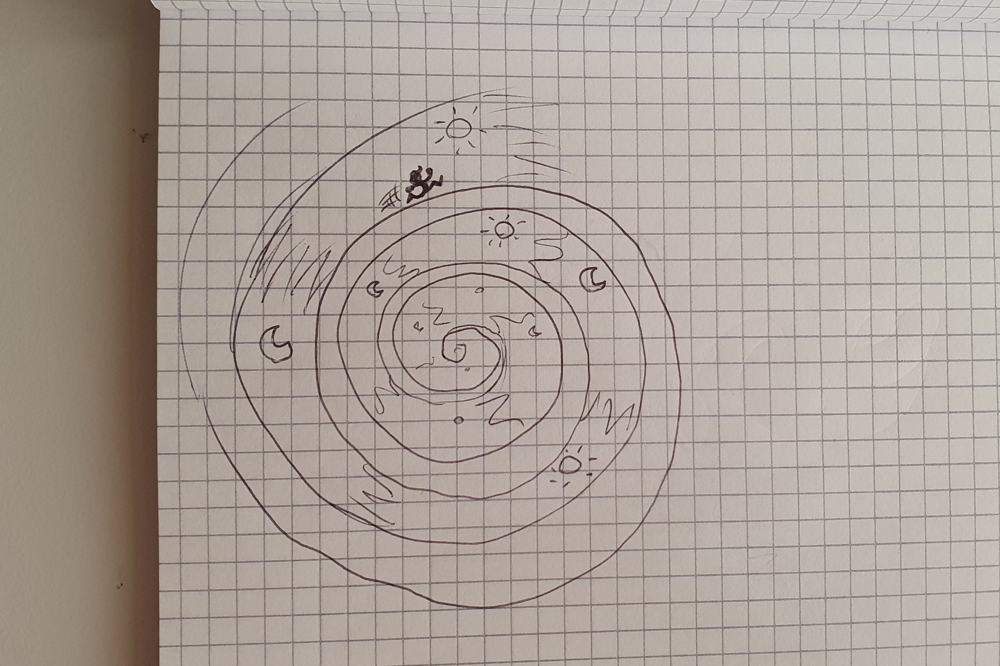
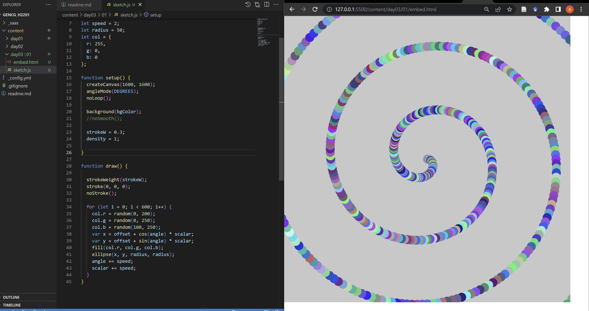
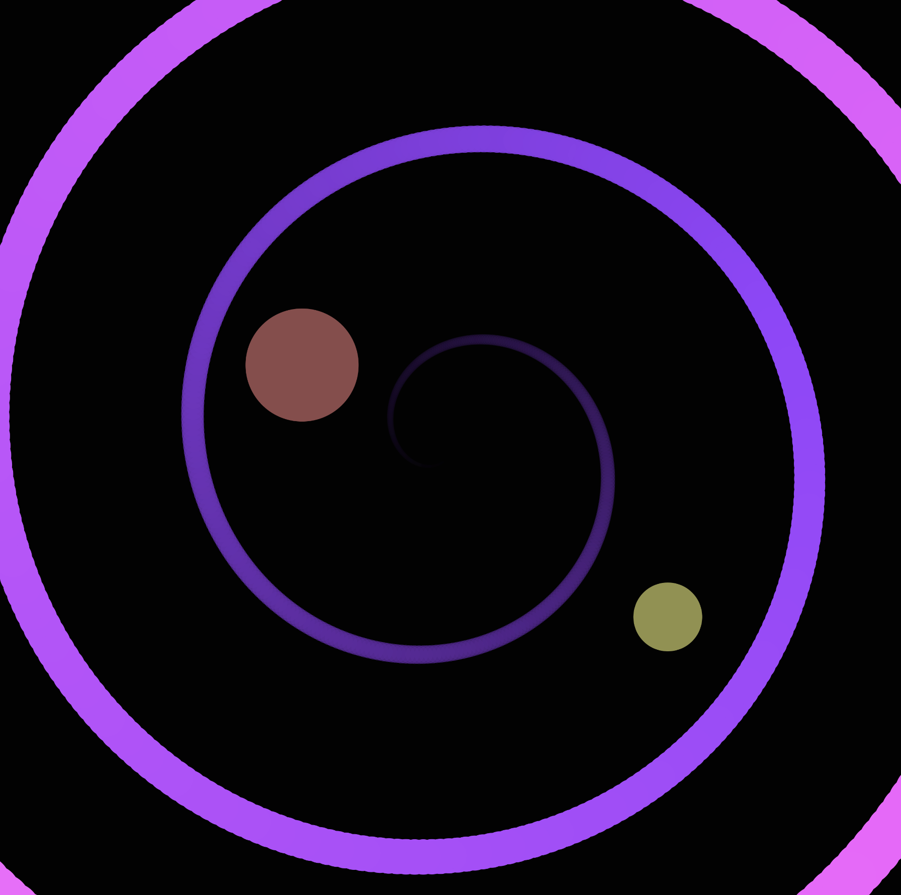

# Day 03

## Clocks

### Visualization of Time
For this task, I wanted to create something clock-like with an element moving in a circle, but still constantly moving forward. With this in mind I decided to create an infinitely moving spiral with an object travelling along the spiral:

The first idea, as can be seen in the sketch, was to have some kind of person running along the path of the spiral. Another feature I had in mind was to cycle through a dark/night-like and a light/day-like background, further displaying the passage of time.

### Implementation

The first thing I did to achieve this effect was to create a spiral originating from the middle of the screen:

Afterwards, I made it move by slightly tilting the spiral in every frame, creating a spinning motion to make it look like it is moving away from us. I then added a ball which travels along the spiral infinitely.


<iframe src="content/day03/02/embed.html" width="100%" height="500px" frameborder="no"></iframe>


### The Difficulty of Synchronized Spirals
For the rest of the day, I tried to add some more circles travelling at different speeds. This turned out to be much more difficult than I thought, and in the end I could only add one more ball (the yellow one) which starts from the center and slowly moves past the other one.

Because I couldn't get this one to be completely displayed in this Markdown, I have a screenshot of the whole image here:

