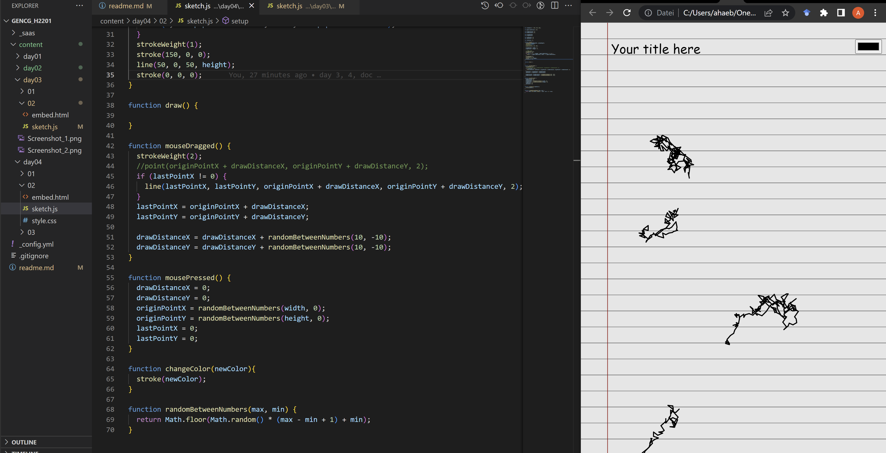

# Day 04

## Drawing Machines

### Paint 2.0
My first thought concerning machine-influenced drawing was the creation of a tool which hinders or completely disregards the intentions of it's user. This first version lets the user draw with the mouse, but just randomly places dots every time he does it:


<iframe src="content/day04/01/embed.html" width="100%" height="450px" frameborder="no"></iframe>


The input is recognized through the "mouseDragged()" function, which runs whenever the mouse is clicked and dragged across the canvas. This allows me to really only create new scribbles when the mouse is actually moved, creating a better immersion for the user who seems to be partially responsible for the chaos that is happening.



The screenshot also already shows an upgraded background and feature to give your drawing a title.
I then also added multiple different drawing tools and colors to choose from, aswell as a feature to download the edited canvas:


<iframe src="content/day04/03/embed.html" width="100%" height="450px" frameborder="no"></iframe>



```js
// Javascript code with syntax highlighting.
var fun = function lang(l) {
  dateformat.i18n = require('./lang/' + l)
  return true;
}
```