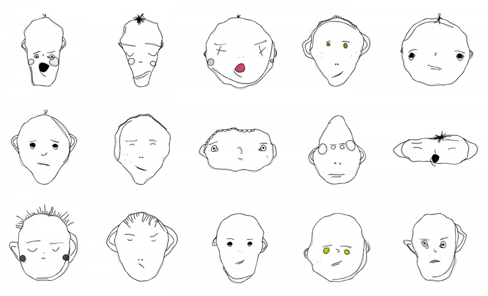

# Day 06

## Faces

### Inspiration
Looking through the different examples for this day, I immediately felt inspired when I saw the "Weird Faces" by Matthias Dörfelt.
These computer generated faces have a very hand drawn feeling to them, which make them pretty expressive in my opinion.

Going off of this example, my goal for this day was to create my own face generator, which is able to create faces that feel distinctly different from each other.

### Generating a Face with Curves
To start off, I created a basic face out of a series of different curves with the p5.js curve() function.

The different facial features consist of single or multiple curves. The eyebrows for example are a seperate curve bent up, while the mouth consists of a main curve and another one for the lower lip. The following is the first hardcoded version of a "complete" face in this manner:


<iframe src="content/day06/01/embed.html" width="600px" height="600px" frameborder="no"></iframe>


### Randomizing the Face
Working off of the created base template, I then started messing around with random values influencing the existing curves. The random values all have a set range which determines the maximum extremity of the changes. The different facial features are also partially affected by each others position, so that I can for example avoid the mouth clipping into the nose. Adding to this, I also created multiple optional facial features, such as visible cheekbones or eyebags. These features have a reduced chance of appearing on the face.
Through these changes, I already have a way to generate many different looking faces (Try refreshing the page to generate another face):


<iframe src="content/day06/02/embed.html" width="600px" height="600px" frameborder="no"></iframe>


### Reflection
All in all, I had much fun with this topic in general, and I will probably try to build off of this face generator at a later point.