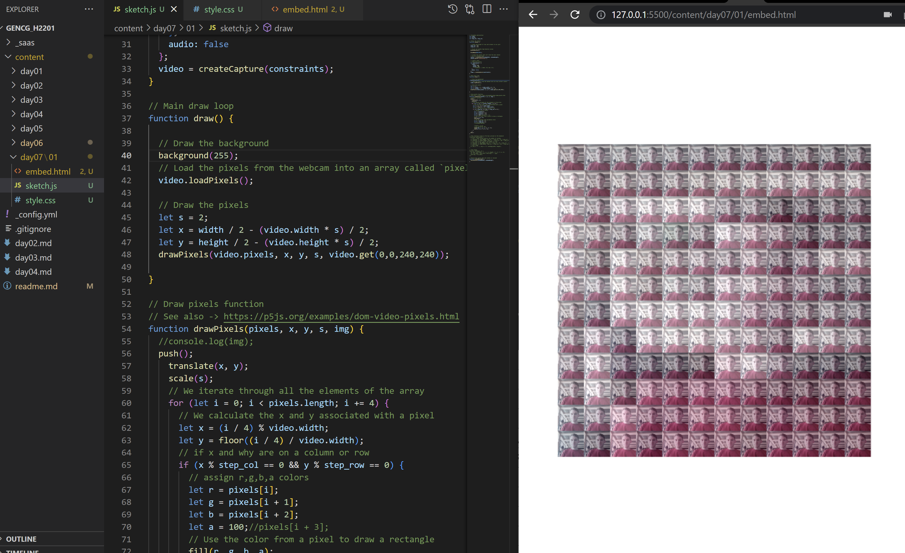
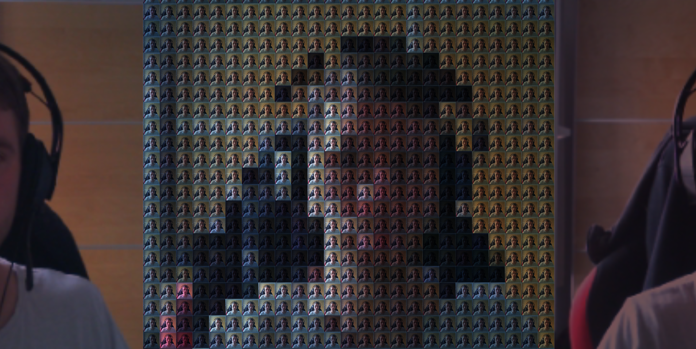

# Day 07

## Pixels

### DISCLAIMER
The usage of the webcam in the following demos was only tested in Google Chrome.
Other browsers have shown to display certain elements at a wrong position or not at all.
It is recommended to use the Chrome browser for this page. Otherwise, screenshots of the results are also provided.
Please also make sure that there isn't any other website using the webcam at the same time as this one.

### The Idea
For this theme, I wanted to do something with the webcam footage. Staying with the theme of pixels, I started out with the example that pixelates the webcam, provided here: https://codepen.io/gu-ma/pen/LggyKa
Afterwards, I thought about how I could put more focus on the individual pixels and how to make them more interesting. This resulted in this first sketch, where every pixel consists of a small camera feed:

### Pixel Coloring Problems
In the previous screenshot, every small video or "pixel" is colored depending on a big version of the video which spans over the whole image. This way, you can also see a pixelated version of the video from the smaller videos.
This effect was first achieved through the use of the p5.js tint() function. Since the average color of all the pixels was already determined to create the pixelated version, I could just reuse this to add the needed color tint to the respective small video.
The problem now was the framerate, which took a hard hit from running the tint() function for every pixel for every frame. The result was a very slow animation, which didn't feel very good to interact with.

### The Solution
After a little bit of searching, I finally came up with a solution to this problem: Removing the tint() function and instead drawing a colored square on top of every video. At first I did this by drawing the rectangles with lowered opacity, but finding a balance between too low or too high opacity was pretty difficult. So instead of this, I finally changed the blendMode of my rectangles to "MULTIPLY", which adds to the color of the videos, making them distinct from each other. This version also runs very smooth again:


<iframe src="content/day07/01/embed.html" width="100%" height="450px" frameborder="no"></iframe>


### Adding Animation
In a last step, I wanted to somehow animate this whole image. Fitting to the theme of images consisting of smaller images would be an endless zoom into one of the smaller videos, revealing that it again consists of many smaller videos.
For this step I made use of the scaling feature to scale up the whole canvas, zooming into the middle of it. The middlemost video will already consist of a second iteration of the pixelated image, which can be zoomed into again. After one loop of the zoom-in, the zoom gets reset, repeating the endless cycle.

Because of the mentioned difficulties with the display of this certain piece, I have linked to the seperate embed.html file here: [Animated Version](content/day07/02/embed.html)

In case this still doesn't work, I have also made this screenshot, showing the animation mid-zoom:


<iframe src="content/day07/02/embed.html" width="100%" height="500px" frameborder="no"></iframe>


### Final Thoughts
For the final animation, I would have also liked to add a slow fade-in effect to the small middle image, so that it wouldn't just "pop" into existence after the cycle repeats.
But right now the only way I know how to change the opacity of a video, is to use the tint() function with a reduced alpha value. Seeing how this affected the overall performance, I decided to leave it as it is.