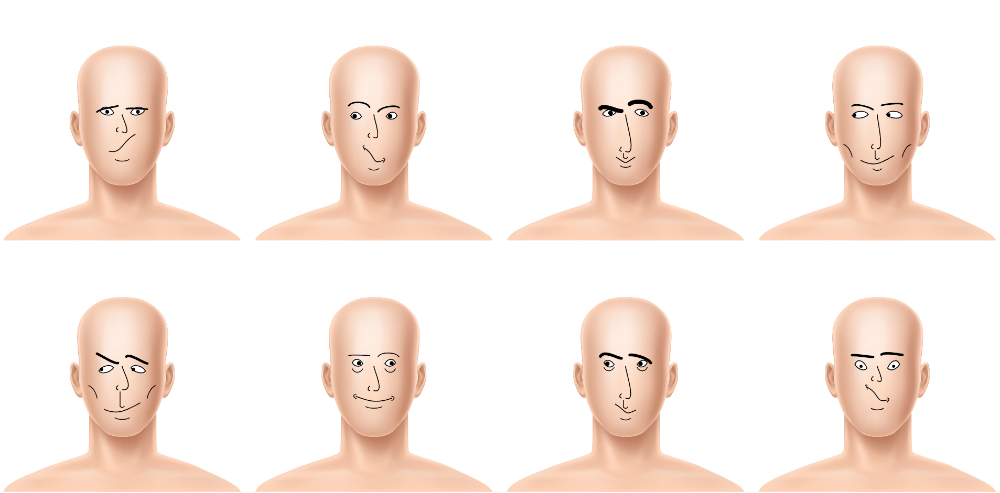

# Day 08

## Working on the Journal
On the morning of this day I mainly worked on completing the journal up until now.

## Improving the Face Generator
I focused the second half of this day to improve one of my sketches. Since the face generator from day 6 was my favourite so far, I decided to continue working on that sketch.

### Improving the Responsiveness
One of the first and most important improvements was to make the whole sketch more responsive. This included making sure that the body and generated face keep an acceptable aspect ratio at all times and don't stretch too much. It also meant that the at the moment hardcoded variables for the entire face had to all change depending on the portrait size. As a solution for this, I created a size factor variable that gets multiplied with every component of the face. This way, only that variable needs to adapt to the window size and change everything else accordingly.
```js
// Determines how many portraits should be displayed next to each other
let numOfPortraits = 4;
let portraitSize;
let sizeFactor;

function setup() {
    // Create canvas according to window size
    createCanvas(windowWidth, windowHeight);
    // Determine width/height of one portrait according to the canvas width
    portraitSize = width / numOfPortraits;
    // Finally, use the size of a portrait to determine the factor for everything inside it
    sizeFactor = portraitSize / 600;
    // ^ This can now be multiplied with every facial feature
}
```

### Multiple Portraits
In the above example, you can already see another improvement that was made, that is the possibility to generate multiple faces at once. The idea here was to have a better comparison point and a way to get more faces to choose from more quickly.



### Replacing the Head Shape
Moving on, I thought about how the different faces could be made even more distinct from each other. The shape of the head is of course another important detail that differs from person to person. For this reason, I decided to get rid of the blank portrait image and also create the head from scratch. Four curves each create a quarter of the complete head. Finally, they only needed two more ellipses for ears, a neck consisting of two lines and again two curves for both shoulders. This way, I could quickly see an improvement in the different portraits that are created:


<iframe src="content/day08/01/embed.html" width="100%" height="450px" frameborder="no"></iframe>


### Adding Animation
As a feature so that the user doesn't have to refresh the page every time, you can simply click on the above example to generate some new faces.
To make this a little more interesting, I created a small animation which cycles between some other faces before then coming to a stop.