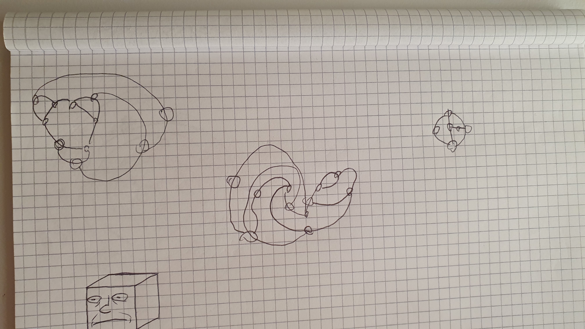
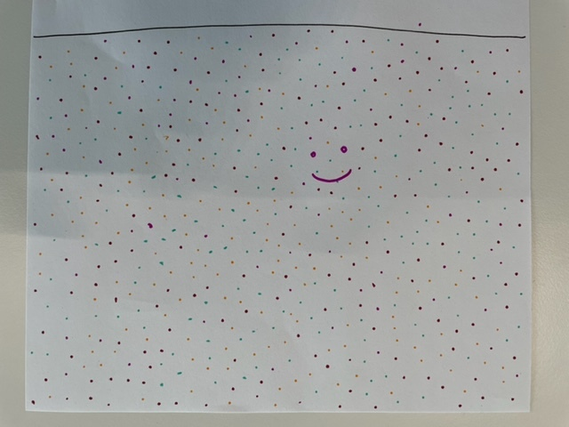
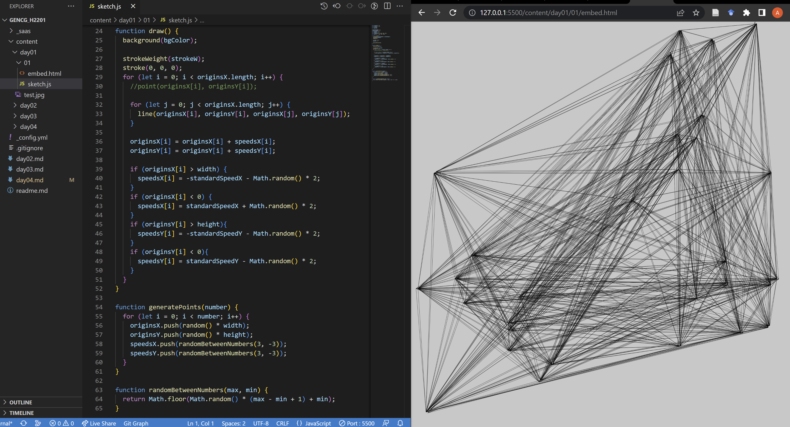

# Day 01

## Computing without computer

### Sprouts
The very first game I tried out was the "Sprouts" game, competing against someone else:

### The Beach
The beach drawing was the second analogue exercise I did in a team of four people. Everyone was taking turns placing dots on the canvas, until we had a pretty dense dot pattern.

## First p5.js exercise
### Replicating the Wall Drawing by Sollewit
As a first task to get into p5.js again, I tried to program the Wall Drawing shown in the examples from scratch.

This worked out surprisingly fast and I even had the time to animate it with every point individually moving around the canvas:


<iframe src="content/day01/01/embed.html" width="100%" height="450px" frameborder="no"></iframe>
