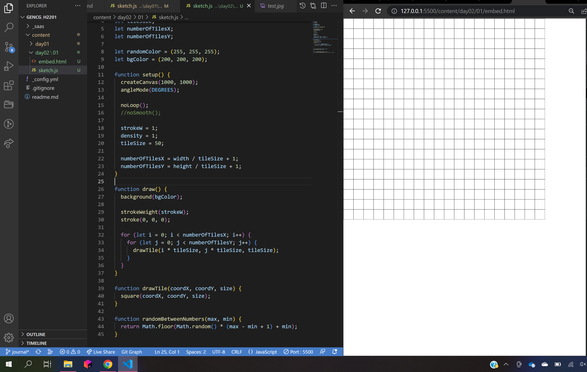
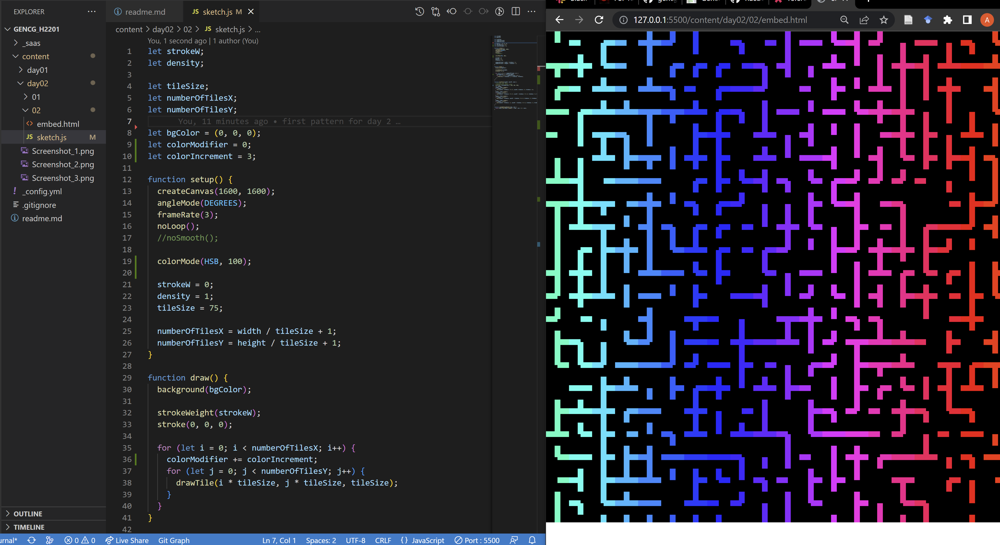
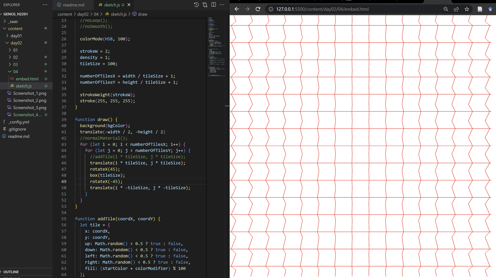
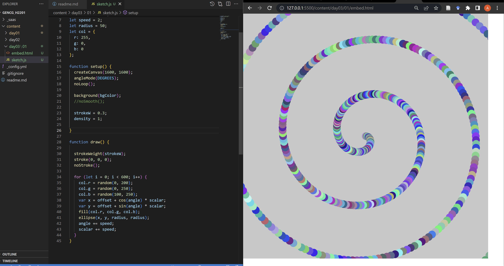

# Day 01

## First Inputs

### Replicating the Wall Drawing by Sollewit
As a first task to get into p5js again, I tried to program the Wall Drawing shown in the examples from scratch.


This worked out surprisingly fast and I even had the time to animate it with every point individually moving around the canvas.


<iframe src="content/day01/01/embed.html" width="100%" height="450px" frameborder="no"></iframe>


# Day 02

## Patterns

### Pattern 1
For the first pattern I started to look for inspiration in some of the available examples.
Eventually I came across this maze pattern that consists of multiple connecting tubes:


My approach to this was to first make a grid consisting of squares:


I could then add smaller shapes into the squares:


Every square can have up to 4 different lines inside of it, which is randomly determined. The four lines point in different directions and can connect with neighbouring tiles, creating small paths. For color I added a gradient effect.


Finally I wanted to add an interactable element so the user could click different tiles and rotate them, to create their own pathways. This wasn't verx exciting by itself, so I also added a small animation which constantly rotates randomly selected tiles.


<iframe src="content/day02/03/embed.html" width="100%" height="450px" frameborder="no"></iframe>


### Pattern 2
For the second pattern, I wanted to do something with in 3D with WebGL. I also started with creating a grid which can be resized through a given tile size variable. This time, I filled it with cubes. Making them rotate on one axis already resulted in a somewhat interesting animation.


Afterwards I started to play with the light source and how the cubes are illuminated. My experimentation ended in this moving pattern:


<iframe src="content/day02/04/embed.html" width="100%" height="450px" frameborder="no"></iframe>


The user can even interact with it, because the mouse also moves the light source around.

# Day 03

## Clocks

### Clock 1
For this task, I wanted to create something clock-like with an element moving in a circle, but still constantly moving forward. With this in mind I decided to create an infinitely moving spiral with an object travelling along the spiral:


The first thing I did to achieve this was to create a spiral originating from the middle of the screen:


Afterwards, I made it move by slightly tilting the spiral in every frame, creating a spinning motion to make it look like it is moving away from us. I then added a ball which travels along the spiral infinitely:


<iframe src="content/day03/01/embed.html" width="100%" height="1600px" frameborder="no"></iframe>


For the rest of the day, I tried to add some more circles travelling at different speeds. This turned out to be much more difficult than I thought, and in the end I could only add one more ball which starts from the center and slowly moves past the other one.


<iframe src="content/day03/02/embed.html" width="100%" height="1600px" frameborder="no"></iframe>


```js
// Javascript code with syntax highlighting.
var fun = function lang(l) {
  dateformat.i18n = require('./lang/' + l)
  return true;
}
```